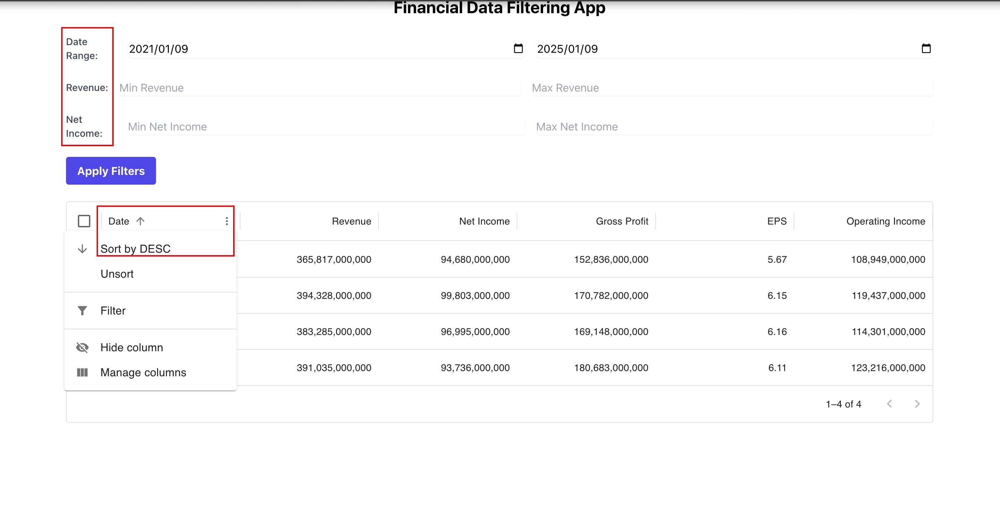

# Finance Data App

The app will fetch annual income statements for AAPL (Apple) and allow users to filter and analyze key metrics.

## Description

- Development: Frontend with React Typescript

- Features: Display data, filter data and sort data

  

- Deployment: Vercel

## How to run the project

### **Step 1: Clone the Repository from GitHub**

Open your terminal and run the following command to clone the project:

```
git clone https://github.com/carmendou/financial-data-app.git
```

Once the repository is cloned, navigate to the project directory:

```
cd financial-data-app
```

### **Step 2: Install Dependencies**

Install the required dependencies using **npm**:

```
npm install
```

This will install all the necessary packages listed in the `**package.json**` file.

### **Step 3: Create a** `**.env**` **File**

Create a `**.env**` file in the root directory of the project to store your environment variables. The application requires an API key to fetch financial data. Add the following line to your `**.env**` file:

```
REACT_APP_API_KEY=your_api_key_here
```

Replace `**your_api_key_here**` with your actual API key.

You can obtain an API key from [Financial Modeling Prep](https://financialmodelingprep.com/).

### **Step 4: Start the Development Server**

Run the following command to start the development server:

```
npm start
```

The application will start on **http://localhost:3000** by default. Open this URL in your browser to view the app.

## Deployment

**https://financial-data-app-two.vercel.app/**
